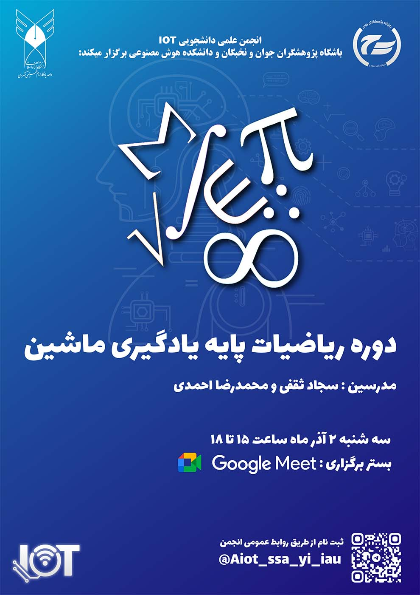

  

## دوره ریاضیات پایه یادگیری ماشین  
**ویژه علاقه‌مندان به هوش مصنوعی و یادگیری ماشین**

**انجمن علمی دانشجویی IOT و هوش مصنوعی دانشگاه آزاد اسلامی واحد یادگار امام خمینی (ره) شهرری**  
با همکاری **باشگاه پژوهشگران جوان و نخبگان** و **دانشکدهٔ هوش مصنوعی** برگزار می‌کند:

### درباره دوره
درک درست الگوریتم‌های یادگیری ماشین بدون شناخت ریاضیات پایه تقریباً غیرممکن است.  
این دوره برای دانشجویان و علاقه‌مندانی طراحی شده که با وجود آشنایی اولیه با برنامه‌نویسی یا یادگیری ماشین، در مفاهیم ریاضی دچار ابهام هستند.

در این دوره، مباحث ریاضی به‌صورت **مفهومی و کاربردمحور** آموزش داده می‌شود تا شرکت‌کنندگان بتوانند منطق درونی مدل‌های یادگیری ماشین را بهتر درک کنند و صرفاً به اجرای کتابخانه‌ها اکتفا نکنند.

### سرفصل‌ها
- مفاهیم پایهٔ بردار و ماتریس در یادگیری ماشین  
- عملیات ماتریسی و نقش آن در مدل‌ها  
- مشتق، گرادیان و مفهوم بهینه‌سازی  
- مبانی احتمال و آمار موردنیاز در ML  
- حل مثال‌های کاربردی و جمع‌بندی مفاهیم  

### اطلاعات برگزاری
- 📅 **تاریخ:** سه‌شنبه ۲ دی ۱۴۰۴  
- ⏰ **ساعت:** ۱۵ تا ۱۸  
- 🌐 **بستر برگزاری:** Google Meet  
- 👨‍🏫 **مدرسین:**  
  - سجاد ثقفی  
  - محمدرضا احمدی  

### ثبت‌نام
شرکت در این دوره **رایگان** است و **ظرفیت محدود** می‌باشد.  
برای ثبت‌نام و دریافت لینک جلسه، از طریق تلگرام پیام دهید:

- ✅ **Telegram ID:** `@Aiot_ssa_yi_iau`

### اطلاع‌رسانی
اطلاع‌رسانی‌های تکمیلی از طریق کانال رسمی انجمن انجام می‌شود:  
- 📢 **Channel:** https://t.me/yadegar_aiot

