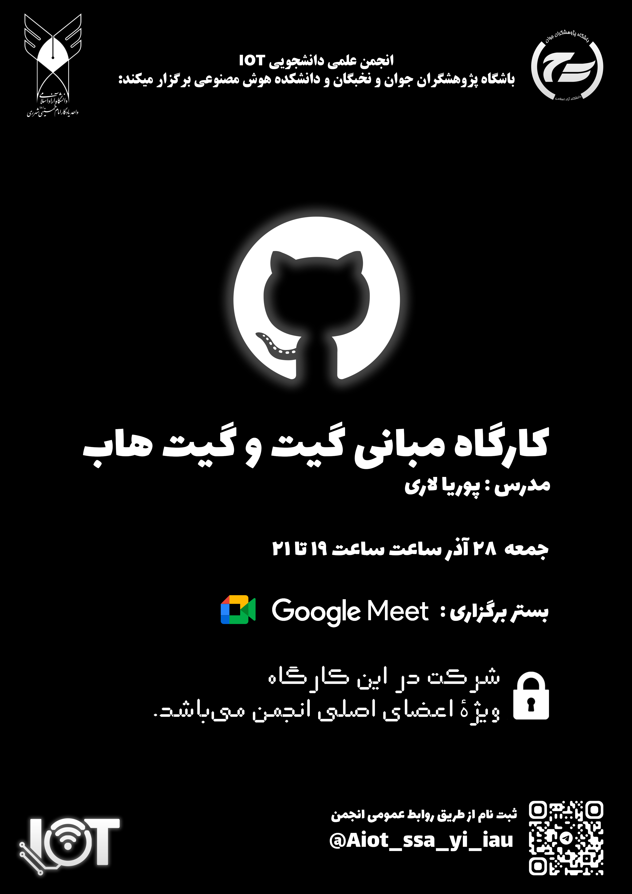

  

## کارگاه مبانی Git و GitHub  
**ویژه علاقه‌مندان به برنامه‌نویسی و کار تیمی**

**انجمن علمی دانشجویی IOT و هوش مصنوعی دانشگاه آزاد اسلامی واحد یادگار امام خمینی (ره) شهرری**  
با همکاری **باشگاه پژوهشگران جوان و نخبگان** و **دانشکدهٔ هوش مصنوعی** برگزار می‌کند:

### درباره کارگاه
Git و GitHub ابزارهای اصلی مدیریت کد و همکاری تیمی در پروژه‌های نرم‌افزاری هستند.  
این کارگاه برای دانشجویان و علاقه‌مندانی طراحی شده است که می‌خواهند به‌صورت اصولی وارد فضای کار تیمی، پروژه‌های واقعی و توسعهٔ نرم‌افزار شوند.

در این جلسه، شرکت‌کنندگان به‌صورت عملی با Git در ترمینال کار می‌کنند، مفاهیم شاخه‌ها و ادغام را یاد می‌گیرند و نحوهٔ همکاری تیمی از طریق GitHub را تمرین می‌کنند.

### سرفصل‌ها
- آشنایی با Git و مفهوم کنترل نسخه  
- ساخت مخزن و ثبت تغییرات (Commit)  
- شاخه‌ها (Branch) و ادغام (Merge)  
- ارتباط مخزن محلی و GitHub (Push / Pull)  
- آشنایی با Pull Request و فرآیند همکاری تیمی  
- آشنایی با رفع تعارض‌ها (Merge Conflict)

### اطلاعات برگزاری
- 📅 **تاریخ:** جمعه ۲۸ آذر ۱۴۰۴  
- ⏰ **ساعت:** ۱۹ تا ۲۱  
- 🌐 **بستر برگزاری:** Google Meet  
- 👨‍🏫 **مدرس:** پوریا لاری ([Pooria-Lari@](https://github.com/Pooria-Lari))

### ثبت‌نام
شرکت در این کارگاه **ویژهٔ اعضای اصلی انجمن** می‌باشد.  
برای ثبت‌نام و دریافت لینک جلسه، از طریق تلگرام پیام دهید:

- ✅ **Telegram ID:** `@AIot_ssa_yi_iau`

### اطلاع‌رسانی
اطلاع‌رسانی‌های تکمیلی از طریق کانال رسمی انجمن انجام می‌شود:  
- 📢 **Channel:** https://t.me/yadegar_aiot

